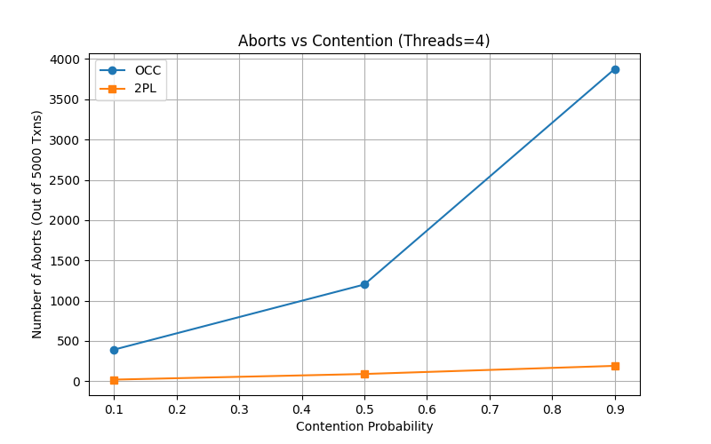
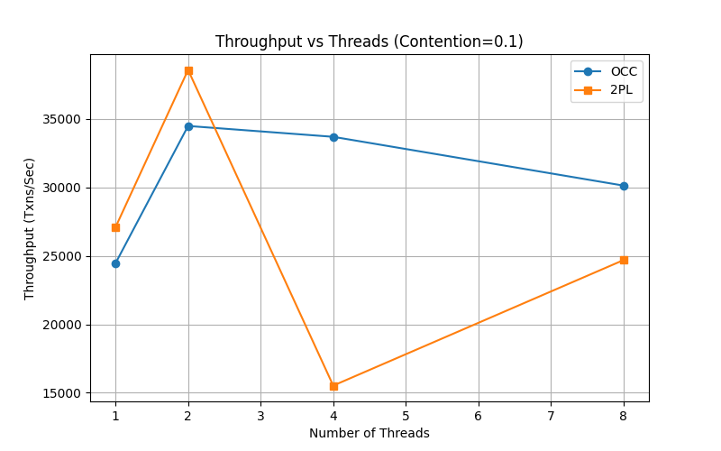
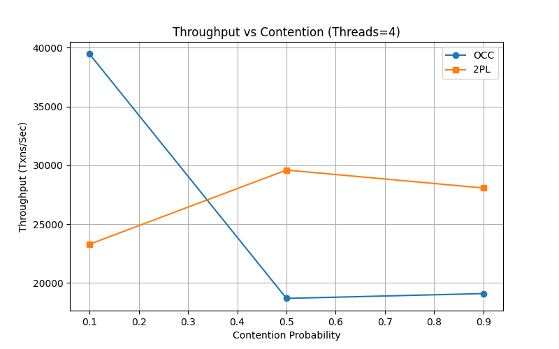
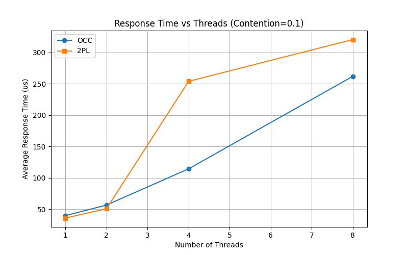
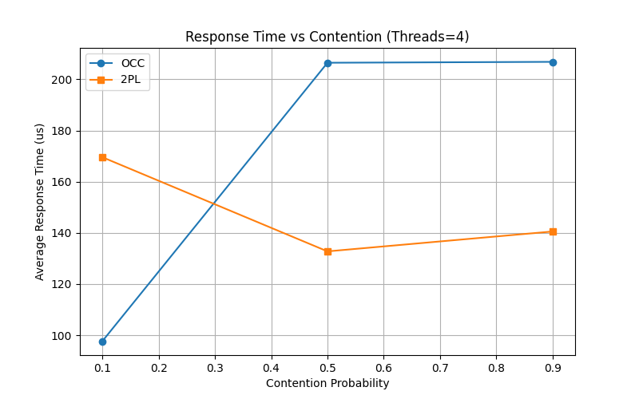
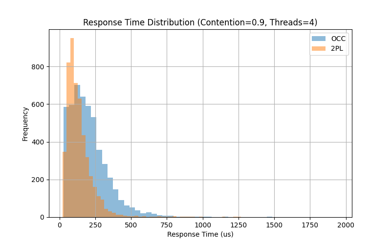

# Multi-Threaded Transaction Processing System Evaluation

## 1. Abstract and Introduction

This report explains the design and evaluation of a multi-threaded transaction processing layer built on top of a database system. The system runs workloads with many concurrent transactions. It uses RocksDB for the storage layer. The transaction layer implements two concurrency control protocols: Optimistic Concurrency Control (OCC) and Conservative Two-Phase Locking (2PL). The goal of this project is to measure and compare the throughput and response time of these two protocols under different levels of contention and numbers of threads.

## 2. Background

Concurrency control ensures that database transactions run safely at the same time without interfering with each other. Optimistic Concurrency Control assumes conflicts are rare. It lets transactions read and write locally, and checks for conflicts right before committing. Conservative Two-Phase Locking assumes conflicts are common. It forces transactions to lock all the records they need before they start working, ensuring no conflicts happen during execution.

## 3. System Design

The system has two layers. The storage layer uses RocksDB to store key and value pairs. The transaction layer manages starting, reading, writing, and committing transactions across multiple worker threads.

### 3.1 Conservative Two-Phase Locking (2PL)

The 2PL protocol uses a lock manager to control access to keys. A transaction looks at the work it needs to do and collects a list of all required keys. It sorts these keys in alphabetical order. Seeking locks in a sorted order helps prevent deadlocks.

The transaction then tries to lock all keys exclusively. The lock manager uses an unordered map and a mutex to track which keys are locked. If a key is already locked by another worker, the `try_lock_exclusive` function returns false immediately.

When a lock request fails, the transaction releases any successful locks it already gathered. It then records an abort, waits for 10 microseconds to prevent livelock issues, and tries again from the beginning. If it gets all locks, it reads the values from RocksDB, applies the writes, commits to the database, and then releases all locks. Since a transaction does not hold locks while waiting for others, deadlocks do not happen. Releasing early and waiting prevents livelocks.

### 3.2 Optimistic Concurrency Control (OCC)

The OCC protocol does not use locks during the read and write phases. A transaction reads values from the storage layer and tracks accessed keys in a read set. Any changes are stored in a local write buffer and the keys are tracked in a write set.

At the commit phase, the transaction enters a sequential validation step. A single mutex in the transaction manager ensures that only one transaction can validate at a time. The system looks at recently committed transactions. If the validating transaction read any keys that were written by those recent transactions, a conflict exists. 

If validation fails, the transaction is rejected. It records an abort, waits for 10 microseconds, and starts over. If validation passes, the transaction applies its local write buffer to the storage engine. Finally, it records its own write set into the history of committed transactions so future validations can check against it.

## 4. Evaluation

We performed tests using the provided `workload2.txt` and `input2.txt` files. We varied the contention probability parameter (0.1, 0.5, 0.9) and the number of threads (1, 2, 4, 8) to execute 5,000 transactions.

### 4.1 Aborts and Retries

Aborts happen when a 2PL transaction cannot obtain all its locks, or when an OCC transaction fails validation due to conflicting writes. 

| Contention | OCC Aborts | 2PL Aborts |
| :--- | :--- | :--- |
| 0.1 | 392 | 20 |
| 0.5 | 1201 | 90 |
| 0.9 | 3878 | 191 |

For 2PL, the number of aborts climbs slightly (20 to 191) as contention increases. Because 2PL checks lock availability at the start and backs off if occupied, it prevents excessive wasted effort. For OCC, the number of aborts grows extremely fast (from 392 to 3878) as contention scales. High contention causes workers to process all reads and local writes before inevitably failing validation at commit time, resulting in many retries.

### 4.2 Throughput

Throughput is measured in committed transactions per second.

**Throughput vs Threads (Contention = 0.1):**
| Threads | OCC (txns/sec) | 2PL (txns/sec) |
| :--- | :--- | :--- |
| 1 | ~24,463 | ~27,092 |
| 2 | ~34,489 | ~38,582 |
| 4 | ~33,696 | ~15,526 |
| 8 | ~30,134 | ~24,693 |

**Throughput vs Contention (Threads = 4):**
| Contention | OCC (txns/sec) | 2PL (txns/sec) |
| :--- | :--- | :--- |
| 0.1 | ~39,451 | ~23,299 |
| 0.5 | ~18,694 | ~29,598 |
| 0.9 | ~19,104 | ~28,076 |

When scaling threads at low contention, both OCC and 2PL initialy improve performance up to two threads, after which lock overhead and OS scheduling limits throughput peaks. When scaling contention at a fixed thread count, 2PL maintains steady performance (~23k to ~28k txns/sec). The OCC throughput drops significantly (from ~39k to ~19k) under high contention because excessive validation failures force transactions to keep retrying.

### 4.3 Average Response Time

Response time measures how long a transaction takes from start to a successful commit, in microseconds.

**Response Time vs Threads (Contention = 0.1):**
| Threads | OCC (us) | 2PL (us) |
| :--- | :--- | :--- |
| 1 | 40 | 36 |
| 8 | 261 | 320 |

**Response Time vs Contention (Threads = 4):**
| Contention | OCC (us) | 2PL (us) |
| :--- | :--- | :--- |
| 0.1 | 97 | 169 |
| 0.9 | 206 | 140 |

For 2PL, as thread limits rise, response times climb because threads block longer attempting to gather exclusive locks safely. 
For OCC, response time stays comparatively short under low contention. When contention approaches the maximum, OCC response times double, although 2PL stays stable.

The distribution of response times for OCC under maximum contention shows a prominent tail. Some transactions repeatedly fail validation and take an unusually long time to finish, whereas 2PL transactions queue systematically for locks and finish within a predictable operational window.

## 5. Conclusion

Both OCC and Conservative 2PL show distinct strengths. OCC works best when contention is very low. It avoids the overhead of managing locks and scales well. However, its performance drops fast when many workers try to write to the same keys. Conservative 2PL provides more stable throughput and predictable response times under high contention. Sorting lock requests and backing off upon failure successfully avoids deadlocks and livelocks. 

## 6. References

1. RocksDB Documentation. Available at rocksdb.org.
